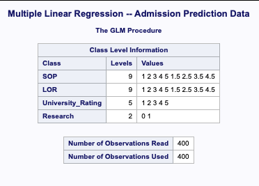
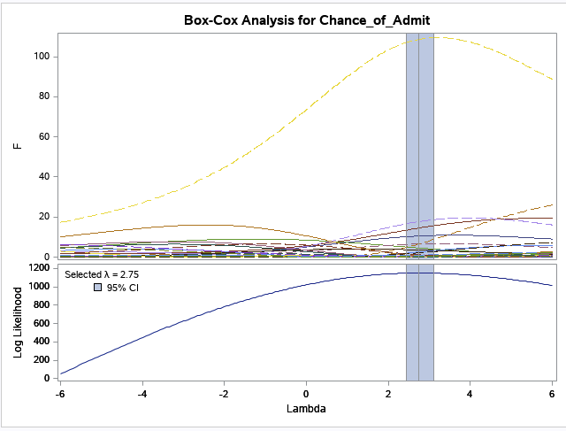
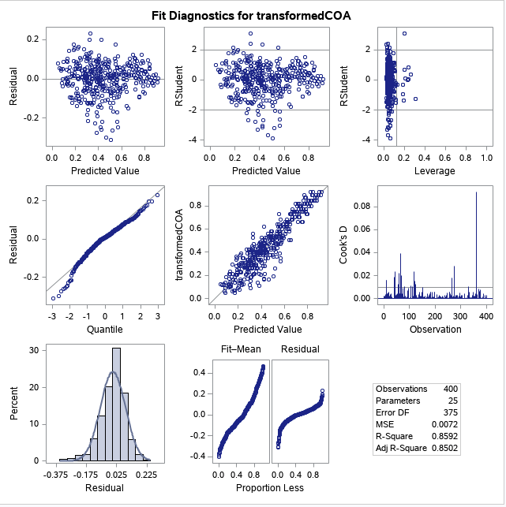
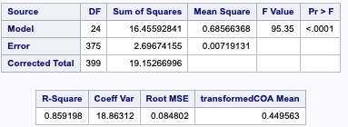

# Predicting-Admissions
 

## Introduction

Under Construction.

## Dataset

The dataset that I am using was obtained from Kaggle and it contains data on university admission data. The dataset contains the following columns:

1. Serial No.
2. GRE Score
3. TOEFL Score
4. University Rating
5. SOP
6. LOR
7. CGPA
8. Research
9. Chance of Admit

The dataset contains 400 entries with no data missing.

## Diagnostics

Through the PROC GLM function, SAS is easily able to build a basic linear model which we can further investigate to determine that it is satisfactory. PROC GLM is also able to differentiate between categorical and continuous regressors.

Here we see the different possible categorical values that can be held in these independent variables.

Here we see the different possible categorical values that can be held in these independent variables.

The current basic linear regression model contains 26 regressor variables where one is an intercept. Here are the respective estimates for each continuous variable regressor and categorical variable regerssor.

#### Estimates

In all linear models we hope that the following four assumptions will be held:

#### 1. $\mathbb{E}(\varepsilon)=0$

#### 2. $Var(\varepsilon)=\sigma^2$

#### 3. $Cov(\varepsilon_i, \varepsilon_j)=0$

#### 4. $\varepsilon_i$~$N(\sigma, (0,1))$

In order to determine if these four assumption are held, we can investigate the diagnostic plots that SAS also generates with the PROC GLM function.

#### Diagnostic Plots

In the Residual vs. Predicted Value plot (top left) we see a fanning pattern in the residuals. While the first assumption of the mean approximately being zero may hold, there seems to be a departure from the second assumption of constant variance; that is, there is hetereoskedasticity present in the dataset. A transform may be required in order to reinstate the constant variance assumption. In the Quantile-Quantile plot (middle left) we see that the points are not hugging the y=x line very strongly. As such, it seems that there is also a departure from the fourth assumption, which is that the residuals are normally distributed. If the residuals were normally distributed, the points would hug the y=x line a lot more tightly. We also know that there are more than 20 observations in our dataset, so we expect the Quantile-Quantile plot to be normal.

In regards with outliers, we see a strongly influential point in the Cook's Distance plot (middle riht) just above approximately 350 on the horizontal axis and it is clearly past the reference line. In fact, we also have a point in the RStudent vs. Leverage (top right) plot which is and outlier and a leverage point since it is past the horizontal and vertical reference lines. Furthermore from the RSdtudent vs Leverage plot there also seems to be a cluster of points that seem to have a lot of influence in the x-space between [0.2, 0.4] on the horizontal axis.

While violating the second and fourth assumptions, our $R^2$ value sits at $0.809$. Perhaps the model can be transformed so that this $R^2$ value can be increased so that there is a better fit. The Box-Cox method is a good fit for this type of problem because there is no clear solution as to what the transformation should be. If the $Var(e)$~$E(y)$, it would make sense to apply a square root transformation or if $Var(e)$~$E(y)^2$ then it would make sense to apply a log transformation. However, neither of these are the case and a Box-Cox transformation seems like the best option.

From our Box-Cox analysis, the ideal $\lambda = 2.75$. After applying the appropriate transformations to the dependent variable, here is what the diagnostics look like:

Here the scatter in the Residual vs Predicted Value plot is a lot more random, and the fanning pattern seems to have disappeared. The residuals have also adhered a lot more to the constant variance assumption. The $R^2$ value has also increased from $0.809$ to $0.859$ indicating that the new model is able to explain more of the variance in the dataset. Furthermore, the points on the Quantile-Quantile plot also seem to hug the y=x line a lot more than they did in the previous model's Quantile-Quantile plot. Overall the new model is definitely better in fit than the previous model.
