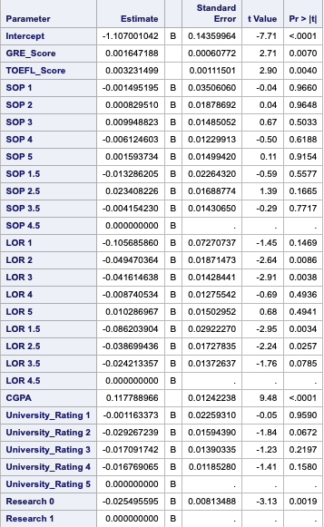
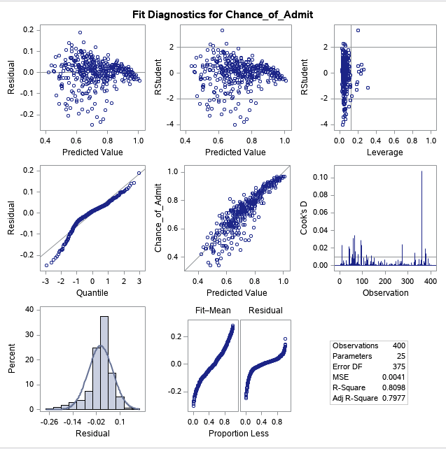

# Predicting-Admissions

## Introduction

Under Construction.

## Dataset

The dataset that I am using was obtained from Kaggle and it contains data on university admission data. The dataset contains the following columns:

1. Serial No.
2. GRE Score
3. TOEFL Score
4. University Rating
5. SOP
6. LOR
7. CGPA
8. Research
9. Chance of Admit

The dataset contains 400 entries with no data missing.

## Diagnostics

Through the PROC GLM function, SAS is easily able to build a basic linear model which we can further investigate to determine that it is satisfactory. PROC GLM is also able to differentiate between categorical and continuous regressors.

Here we see the different possible categorical values that can be held in these independent variables.

Here we see the different possible categorical values that can be held in these independent variables.

In all linear models we hope that the following four assumptions will be held:

##### 1. The expected value of the residuals is zero

##### 2. The residuals have constant variance

##### 3. The residuals are independent

##### 4. The residuals are normally distributed

In order to determine if these four assumption are held, we can investigate the diagnostic plots that SAS also generates with the PROC GLM function.

The current basic linear regression model contains 26 regressor variables where one is an intercept. Here are the respective estimates for each continuous variable regressor and categorical variable regerssor.

#### Estimates

#### Diagnostic Plots

In the Residual vs. Predicted Value plot (top left) we see a fanning pattern in the residuals. While the first assumption of the mean approximately being zero may hold, there seems to be a departure from the second assumption of constant variance; that is, there is hetereoskedasticity present in the dataset. A transform may be required in order to reinstate the constant variance assumption. In the Quantile-Quantile plot (middle left) we see that the points are not hugging the y=x line very strongly. As such, it seems that there is also a departure from the fourth assumption, which is that the residuals are normally distributed. If the residuals were normally distributed, the points would hug the y=x line a lot more tightly. In regards with outliers, we see a strongly influential point in the Cook's Distance plot (middle riht) just above approximately 350 on the horizontal axis and it is clearly past the reference line. In fact, we also have a point in the RStudent vs. Leverage (top right) plot which is and outlier and a leverage point since it is past the horizontal and vertical reference lines. Furthermore from the RSdtudent vs Leverage plot there also seems to be a cluster of points that seem to have a lot of influence in the x-space between [0.2, 0.4] on the horizontal axis.
