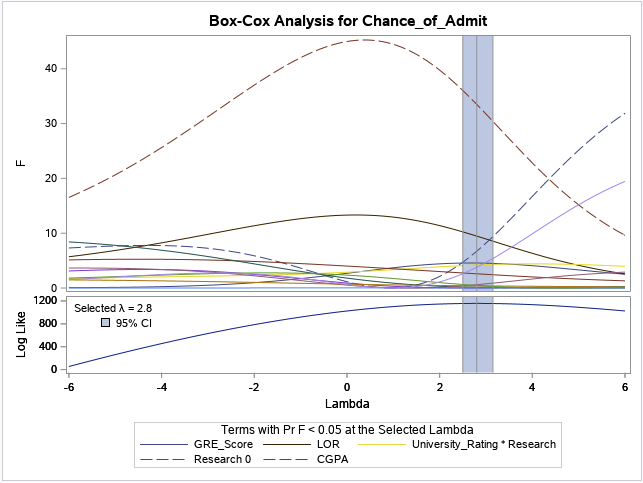

## Introduction

In this exercise, I'm analyzing a university dataset which contains information about student admissions. I am hoping to build a generalized linear model in order to reliably predict a student's admission to the university using SAS.

# Exploratory Data Analysis

## Dataset

The dataset that I am using was obtained from Kaggle and it contains data on university admission data. The dataset contains the following columns:

1. Serial No.
2. GRE Score
3. TOEFL Score
4. University Rating
5. SOP
6. LOR
7. CGPA
8. Research
9. Chance of Admit

The dataset contains 400 entries with no data missing. The only categorical variable is Research, as Serial No. is not considered, and the rest of the variables are continuous.

## Data Exploration

There is one categorical variable, Research, which is already encoded as a 0 for no participation in research and 1 for participation in research. The predicted variable of interest is the ninth variable, Chance of Admittance, I am hoping to use a subset of the first eight variables in order to reliably fit a model which is able to explain the variability in the ninth variable well. Furthermore, it doesn't make sense to include the first variable, Serial No., in the basic model because it is random for each student and doesn't effectively convey any meaning.

# Analysis

## Basic Model

Through the PROC GLM function, SAS is easily able to build a basic linear model that considers all the variables with interactions, which can be further investigated to determine to see if the linear regression assumption are met. PROC GLM is also able to differentiate between categorical and continuous variables by indicating so in the CLASS definition of the function. As such, "Research" is specified as a categorical variable in the CLASS method. The basic model with interaction terms is as follows:

## Diagnostic Plots

In the diagnostic plots below there is a departure from the homoskedasticity assumption, that is of constant variance throughout the data, because of the decreasing variance in the data in the Residual vs Predicted Value plot and RStudent vs Predicted Value plot. There also appears to be a departure from the assumption of the expected value of the residuals to equal zero as the data in the two aforementioned plots is not centred around the horizontal zero axis. Finally, the data does not appear to be normally distributed as the Residual vs Quantile Plot shows that the points are not very closely hugging the reference line.

## Transformations

Using the data-driven Box-Cox technique, showed below, we can estimate the best transformation for the basic linear model which should result in diagnostic plots which have less of a departure from the linear regression assumptions.

## Results

The R-Squared value has increased from 0.807246 to 0.860190 in the transformed model, indicating that the transformed model is able to explain more variability in the predicted values than the initial model was able to. Furthermore, there appears to be a significantly less departure from the linear regression assumptions as is seen in the diagnostic plots.

Using SAS procedures, I was able to develop a model which explained the predicted results 4.95% more accurately than the base model which contained 14 covariates compared to the reduced model which contained only six, thus resulting in less computational power for future use and increased accuracy.

The full report is presented available in the LaTeX folder in the repository.
